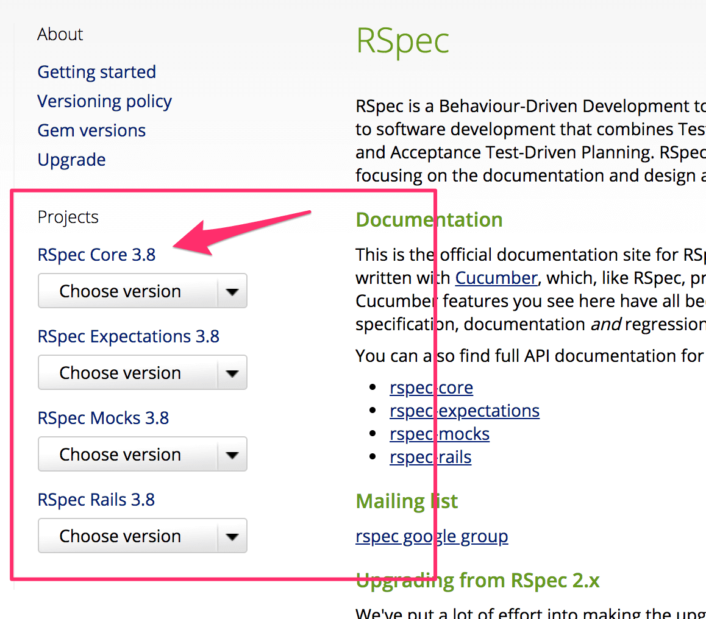

# アプリケーションを読み解いていく
実践課題では実装途中の slackpad-server を完成させていくわけですが
実装済み部分について理解をしなければ足りない部分の実装をしていくこともできません。
ここでは slackpad-server の実装について、Rails や周辺ツールについての説明を交えつつ
説明します。

<!-- TOC -->

- [アプリケーションを読み解いていく](#アプリケーションを読み解いていく)
    - [コードを読み解く](#コードを読み解く)
        - [Gemfile, Gemfile.lock](#gemfile-gemfilelock)
            - [バージョン指定](#バージョン指定)
            - [bundle update](#bundle-update)
            - [group 指定](#group-指定)
            - [Gemfile](#gemfile)
        - [config/routes.rb](#configroutesrb)
            - [resources, resource](#resources-resource)
            - [namespace](#namespace)
            - [`match "/ws", to: ChatApp.new, via: :all`](#match-ws-to-chatappnew-via-all)
                - [Rails ルーティングと Rack アプリケーションの関係が気になる人向けの補足](#rails-ルーティングと-rack-アプリケーションの関係が気になる人向けの補足)
        - [db/](#db)
            - [db/migrate/](#dbmigrate)
            - [db/schema.rb](#dbschemarb)
            - [db/seeds.rb](#dbseedsrb)
        - [app/models/](#appmodels)
            - [has_many, belongs_to](#has_many-belongs_to)
        - [app/controllers/](#appcontrollers)
            - [ChannelsController](#channelscontroller)
            - [ImagesController](#imagescontroller)
        - [app/middlewares/chat_app.rb](#appmiddlewareschat_apprb)
            - [`ChatApp#process_message`](#chatappprocess_message)
    - [spec/](#spec)
        - [spec/requests/api_spec.rb](#specrequestsapi_specrb)
        - [spec/features/chat_spec.rb](#specfeatureschat_specrb)
    - [不足している実装](#不足している実装)
        - [REST API](#rest-api)
        - [Chat Protocol](#chat-protocol)

<!-- /TOC -->

## コードを読み解く
以下では slackpad-server のコードを読み解いていきます。

### Gemfile, Gemfile.lock
Bundler という gem パッケージ管理ツールの設定ファイル。
現代的な ruby アプリケーションは（当然 Rails アプリケーションも）依存 gem パッケージを Bundler で管理するのが普通です。
rails そのものも gem パッケージとして提供されています。

<https://bundler.io/>

#### バージョン指定
Gemfile ではアプリケーションで利用する gem パッケージを指定します。

```ruby
gem 'rails', '~> 5.2.0'

gem 'faye-websocket'
gem 'kaminari'
gem 'puma', '~> 3.11'
gem 'sqlite3'
```

`gem 'rails', '~> 5.2.0'` は `'rails'` が gem 名、 `'~> 5.2.0'` がバージョンを指定しています。
（公式の）gem パッケージは <https://rubygems.org/> でホスティングされており、
rails gem だと <https://rubygems.org/gems/rails> を見るとリリースされている gem のバージョンやその gem が依存している gem の情報などが確認できます。

`'~> 5.2.0'` というバージョン指定は少し複雑で `>= 5.2.0` かつ `< 5.3` という意味で、5.2.0, 5.2.1, 5.2.10 といったバージョンを含みます。

`gem 'faye-websocket'` のような指定はバージョン番号を指定していません。

上記のように Gemfile で対象パッケージを指定したアプリケーションのディレクトリにて
`bundle install` コマンドを実行すると対象 gem とそれらの gem が依存している gem がインストールされ、Gemfile.lock が作成されます。
この時インストールされる gem のバージョンは Gemfile 内で指定された gem で矛盾のない適切なバージョンとなります。

Gemfile しかない状態でインストールされる gem のバージョンは `bundle install` を実行する時期によって異なります。
しかし各開発者が `bundle install` するタイミング、また本番サーバにデプロイされるタイミングで違うバージョンの
gem がインストールされては困ります。そのため初めて `bundle install` を実行すると
インストールされた gem のバージョンが記録された
Gemfile.lock というファイルが生成されます。
Gemfile.lock がある状態で `bundle install` を実行すると必ず同じバージョンの gem がインストールされます。

#### bundle update
Gemfile.lock に記述された gem のバージョンについては `bundle update` コマンドを実行することでアップデートできます。
Gemfile を変更していなくても、対象 gem の新規リリースがある場合などバージョンが更新されることもあります。
Gemfile でのバージョン指定を更新した場合にも `bundle update` を実行し、gem のバージョンを更新します。

Gemfile に記述するバージョン指定については全て細かく指定することもできますが、
ある程度大きめに指定して
`bundle update` による gem 更新をしやすくしておくのがオススメです。

具体的にどういう指定をすべきかは時と場合によりますが、重要度や
バージョンアップポリシーが不安定な gem ほど対象バージョンの指定を狭くする
というのがよくある方針です。

#### group 指定
以下のような `group :development` ブロックで指定された gem は development 時、つまり手元での開発時のみ利用される開発用の gem パッケージです。

```ruby
group :development do
  gem 'listen', '>= 3.0.5', '< 3.2'
  gem 'pry-rails'
end
```

また `group :development, :test` のような指定では development 時と test 時に有効となります。

#### Gemfile
slackpad-server では（development, test を除くと）以下の gem が指定されています。

- rails
  - Rails 本体の gem です。
- faye-websocket
  - <https://github.com/faye/faye-websocket-ruby>
  - 比較的よく使われている、素の WebSocket 対応機能を提供する gem です。
- kaminari
  - <https://github.com/kaminari/kaminari>
  - ページネーション機能を提供する gem です。
- puma
  - <https://github.com/puma/puma>
  - Rails でデフォルトでインストールされる Rack 対応ウェブサーバ gem です。
- sqlite3
  - Rails でデフォルトでインストールされる SQLite3 をデータベースとして扱うための gem です。
- bootsnap
  - Rails でデフォルトでインストールされる起動高速化のための gem です。

つまり Gemfile から slackmap-server が Rails 製のウェブアプリケーションで、
faye-websocket gem を用いて WebSocket の機能を提供していることらしいことがわかります。

### config/routes.rb
Rails アプリケーションのルーティングが記述された設定ファイル。
この設定ファイルを読むとアプリケーションがどのようなリクエストに対応しているかわかります。

記述方法などは <https://railsguides.jp/routing.html> にまとまっています。

```ruby
Rails.application.routes.draw do
  match "/ws", to: ChatApp.new, via: :all

  resources :channels, only: %i(index)
  resources :images, only: %i(show create)

  namespace :hello do
    resource :health, only: %i(show)
  end
end
```

#### resources, resource
Rails の一番基本的なリソースベースのルーティング記述方法です。

<https://railsguides.jp/routing.html#リソースベースのルーティング-railsのデフォルト>

Rails がこの記述方法をデフォルトとしているのは二つの基本理念

- 同じことを繰り返すな (Don't Repeat Yourself)
- 設定より規約 (Convention Over Configuration)

が強く現れている部分です。つまり Rails は URL は REST に沿って設計すべきであるという規約で設計されたフレームワークであり、規約に基づいていると記述が簡潔になるように設計されています。

実際の設定は以下のようなルーティングに対応します。

- `resources :channels, only: %i(index)`
  - `GET /channels` -> `ChannelsController#index`
- `resources :images, only: %i(show create)`
  - `GET /images/:id` -> `ImagesController#show`
  - `POST /images` -> `ImagesController#create`

これは resources, resource を利用しなかった場合以下のような記述と同じ意味となります。

```ruby
get "/channels", to: "channels#index", as: "channels"
get "/images/:id", to: "images#show", as: "image"
post "/images", to: "images#create", as: "images"
```

#### namespace
ルーティングとコントローラを名前空間でグループ化するための記法です。

<https://railsguides.jp/routing.html#コントローラの名前空間とルーティング>

slackmap-server でも `namespace :hello do` として設定されており、以下のように解釈されます。

- `namespace :hello do; resource :health, only: %i(show); end`
  - `GET /hello/health` -> `Hello::HealthsController#show`

#### `match "/ws", to: ChatApp.new, via: :all`
この記述は routes.rb 内で Rack アプリケーションに直接ルーティングする少し特殊な記法です。

<https://railsguides.jp/routing.html#rackアプリケーションにルーティングする>

`match "/ws", to: ChatApp.new, via: :all` は `/ws` というパスへのリクエストはどの HTTP メソッドであっても ChatApp という Rack アプリケーションに処理させるという記述です。

##### Rails ルーティングと Rack アプリケーションの関係が気になる人向けの補足
実は routes.rb で Rack アプリケーションに直接ルーティングする記法は特別なものではありません。実際には `get "/channels", to: "channels#index", as: "channels"` という記述は `get "/channels", to: ChannelsController.action(:index), as: "channels"` と書くのと同じ意味です。`ChannelsController.action(:index)` は `ChannelsController#index` を呼ぶ Rack アプリケーションを返します。

このように Rails のウェブアプリケーションとしての機能の多くは Rack アプリケーションとして提供されています。

### db/
db/ 以下にはマイグレーションなどデータベース関連のファイルが格納されます。

<https://railsguides.jp/active_record_migrations.html>

#### db/migrate/
db/migrate/ 以下には Active Record マイグレーションのファイルが格納されます。マイグレーションは Rails の提供する DSL にてデータベースに対するスキーマ変更方法が記述されています。

新たなマイグレーションを作成する時は
`bin/rails generate migration AddPartNumberToProducts` のようなコマンドで雛形を生成し、
生成された `db/migrate/20180712092755_add_part_number_to_products.rb` といった名前のファイルにスキーマ変更を記述します。

db/migrate/ 以下に記述されたマイグレーションを実行するには `rails db:migrate` コマンドを実行します。

#### db/schema.rb
マイグレーションを適用した結果のデータベーススキーマは db/schema.rb にダンプされています。
このファイルは `bin/rails db:migrate` で自動生成されるため、直接手で編集することはありません。

このファイルにはデータベーススキーマ情報がコンパクトに収まっているため、スキーマの概要を把握するのにも便利です。

<https://railsguides.jp/active_record_migrations.html#スキーマダンプの意義>

schema.rb には以下のように記述されています。

```ruby
create_table "channels", force: :cascade do |t|
  t.string "name", limit: 100, null: false
  t.datetime "created_at", null: false
  t.datetime "updated_at", null: false
end

create_table "images", force: :cascade do |t|
  t.string "filename", limit: 100, null: false
  t.text "data", null: false
  t.datetime "created_at", null: false
  t.datetime "updated_at", null: false
end

create_table "messages", force: :cascade do |t|
  t.integer "channel_id", null: false
  t.string "nickname", limit: 100, null: false
  t.string "message", limit: 5000, null: false
  t.datetime "created_at", null: false
  t.datetime "updated_at", null: false
end
```

詳細を読み解くにはドキュメントを読み込む必要があるかもしれませんが

- channels
- images
- messages

の三つのテーブルが定義されており、それぞれ `name` や `filename` といったカラムが定義されていることがわかるかと思います。

#### db/seeds.rb
このファイルには初期データを投入するための記述をします。

seeds.rb に記述した内容は `bin/rails db:seeds` または `bin/rails db:setup` で実行されます。
（`bin/rails db:setup` は `bin/setup` 内で実行されているため、このドキュメントを読んでいる人は実行済みです）

<https://railsguides.jp/active_record_migrations.html#マイグレーションとシードデータ>

slackpad-server の seeds.rb には以下のように記述されており、初期データとして general チャンネルの作成、システムからの general チャンネルへの初期メッセージが生成されています。

```ruby
general = Channel.find_or_create_by!(name: "general")

if Message.count == 0
  general.messages.create!(nickname: ChatApp::SYSTEM_NAME, message: "ようこそ、こんにちは！")
end
```

### app/models/
app/models/ 以下には「モデル」を定義するクラスが格納されます。
モデルのクラスは Rails アプリケーションの場合その多くは Active Record のクラスです。

<https://railsguides.jp/active_record_basics.html>

slackpad-server では以下の四つのクラスが定義済みです。

- ApplicationRecord
  - ApplicationRecord は基本的に app/models 以下の全てのモデルの継承元として設定するような基本的なメソッドを定義するクラスです。
- Channel
  - `channels` テーブルにマッピングされたモデルクラスです。
- Image
  - `images` テーブルにマッピングされたモデルクラスです。
- Message
  - `messages` テーブルにマッピングされたモデルクラスです。

Channel, Image, Message などの定義を見るとマッピングするテーブル名やカラム名などが一切記述されていないことに気づくかと思います。

```ruby
class Channel < ApplicationRecord
  has_many :messages
end
```

これはまさに「同じことを繰り返すな」「設定より規約」の思想にのっとり「カラム名や型などは Rails がデータベースから自動的に取得する」「`Channel` というクラス名なら `channels` テーブルを扱うモデルのはず」というように自動的に設定したりデフォルト値を決めているため記述が簡潔になっている例です。

#### has_many, belongs_to
Channel, Message モデルではそれぞれ `has_many :messages`, `belongs_to :channel` という記述があります。
これらはモデル間の「チャンネルには複数のメッセージが存在する」「メッセージは唯一つのチャンネルに属する」というアソシエーションが定義しています。

<https://railsguides.jp/association_basics.html>

### app/controllers/
先の routes.rb の解説で先行していくつかのコントローラが登場しましたが、クライアントからのリクエストを受ける処理を記述するところがコントローラです。

<https://railsguides.jp/action_controller_overview.html>

slackpad-server には以下の四つのコントローラが存在します。

- ApplicationController
  - ApplicationController は基本的に app/controllers 以下の全てのコントローラの継承元として設定するような基本的なメソッドを定義するコントローラです。通常 ApplicationController に直接ルーティングするようなことはしません。
- ChannelsController
  - Channel モデル（リソース）を扱うコントローラです。
- ImagesController
  - Image モデル（リソース）を扱うコントローラです。
- Hello::HealthsController
  - アプリケーションのヘルスチェック用のコントローラです。

#### ChannelsController

```ruby
class ChannelsController < ApplicationController
  def index
    render json: JSON.dump(Channel.all.to_a.map(&:serializable_hash))
  end
end
```

Channel モデルを扱うコントローラです。`GET /channels` を処理する `ChannelsController#index` のみ提供し、このメソッドでは `channels` テーブルから全件レコードを取得し、JSON に変換し render しています。

#### ImagesController
```ruby
class ImagesController < ApplicationController
  def show
    image = Image.find(params[:id])
    send_data image.decode, type: image.content_type, disposition: :inline
  end

  def create
    image = Image.create!(filename: params[:filename], data: params[:data])
    render json: JSON.dump(image.serializable_hash(except: :data))
  end
end
```

Image モデルを扱うコントローラです。以下の機能が提供されています。

- `POST /images` を処理する `ImagesController#create`
  - アップロードされてきた画像を `images` テーブルに保存
- `GET /images/:id` を処理する `ImagesController#show`
  - 与えられた `id` パラメタを用いて `images` テーブルから画像を取得して表示

### app/middlewares/chat_app.rb
このファイルは `match "/ws", to: ChatApp.new, via: :all` の記述で使われている
独自 Rack アプリケーションを定義しています。
この Rack アプリケーションでは Gemfile にも出てきた faye-websocket を利用して
WebSocket をハンドリングしています。

faye-websocket の機能を理解するには faye-websocket 自体のドキュメント
<https://github.com/faye/faye-websocket-ruby>
や
Heroku による ruby での WebSocket の扱い方を解説したドキュメント
<https://devcenter.heroku.com/articles/ruby-websockets>
が参考になります。

上記ドキュメントにある通り faye-websocket では `ws.on :message do |event|`
に囲まれた部分にメッセージの処理方法を記述します。

slackpad-server では以下のように定義されており、WebSocket メッセージ処理の本体は
`ChatApp#process_message` に記述されています。

```ruby
ws.on :message do |event|
  Rails.logger.debug("Message #{ws}: #{event.data}")
  process_message(event)
end
```

#### `ChatApp#process_message`
`event.data` には websocket メッセージの本文が入ります。
`ChatApp#process_message` では `prefix, command, params = parse_message(event.data)` という記述からメッセージを prefix, command, params という三つの部分に分解し、処理していることが読み取れます。

処理内容を以下に抜き出します。コマンドに応じた処理が実装されていますが、
user, message のコマンドしか実装が存在しません。
join, part, list のコマンド内容が実装されておらず、
また message コマンドでは対象チャンネルは general 決め打ちとなっています。
つまりこの ChatApp ではチャンネル関連の機能がほぼ一切実装されていません。

```ruby
case command
when :user
  username = params[0]
  users[ws] = username
  reply(ws, username, :user, [username])
when :join
  # todo
when :part
  # todo
when :message
  username = users[ws]
  channel_name = params[0]
  text = params[1]
  channel = channel.find_by!(name: "general")
  users.keys.each do |user_ws|
    reply(user_ws, username, :message, params)
  end
  channel.messages.create!(nickname: username, message: text)
when :list
  # todo
```

## spec/
RSpec で記述するテストケース、設定などは spec/ 以下に配置します。

テスト間で共通の設定等は spec/spec_helper.rb, spec/rails_helper.rb に書きます。

ドキュメントは https://relishapp.com/rspec にまとまっているのでそちらを参照してください。
RSpec 記法や `rspec` コマンドの使い方などのコア機能については RSpec Core を、RSpec での Rails のテストの書き方等は RSpec Rails のドキュメントを参照してください。


### spec/requests/api_spec.rb
slackpad-server の REST API のテストが記述されています。

以下の記述は `GET /channels/:channel_id/messages` の正常系のテストを記述したものです。

```ruby
  describe "GET /channels/:channel_id/messages" do
    let(:channel) { Channel.find_by!(name: "general") }
    before do
      channel.messages.create!(nickname: "superman", message: "hello!")
    end

    it "success" do
      get "/channels/#{channel.id}/messages"
      expect(response).to be_successful
      expect(response.body).to be_json_including([
        { nickname: "superman", message: "hello!" },
        { nickname: "slackpad", message: "ようこそ、こんにちは！" },
      ])
    end
  end
```

- `describe` ではテストする対象に `GET /channels/:channel_id/messages` という名称をつけつつ、そのブロック以下をひとまとめにしています。（ひとまとめにする、と言いつつここではテストは一つしかありませんが）
- `let(:channel) { ... }` は `{ ... }` の評価結果を `channel` として参照できるように宣言しています。
  - ただし `channel` が呼び出させるまでは `channel` は作成されません。
  - `let!(:channel) { ... }` のように `!` をつけると呼び出されなくても先に `channel` が作成されます。
- `before` はそのブロック内のテストを動かす前におこなう前処理を記述します。
- `it` のブロックでは実際の検証したい処理内容（ example と呼びます）を記述します。
  - `get "/channels/#{channel.id}/messages"` は slackpad-server に `GET /channels/.../messages` というリクエストを送ると
  - `expect(response).to be_successful` はレスポンスが成功することを検証、
  - `expect(response.body).to be_json_including(...)` はレスポンスボディを JSON としてパースしその中身を検証しています。

つまりこの記述は `GET /channels/:channel_id/messages` のリクエストが送られてきた時に slackpad-server が期待したレスポンスを返してくれることを検証するテストコードです。

このように Rails アプリケーションに対しリクエストを送った時の振る舞いを記述するテストを Request spec と呼びます。

Relish の RSpec Rails 以下にドキュメントがまとめられているので、読解に詰まった時は以下のドキュメントを参照してみてください。
<https://relishapp.com/rspec/rspec-rails/docs/request-specs/request-spec>

### spec/features/chat_spec.rb
slackpad-server の Chat Protocol のテストが記述されています。

app/middlewares/chat_app.rb の説明で記述しましたが、slackpad-server では
faye-websocket を利用した独自の Rack アプリケーションを定義し
WebSocket Chat Protocol 対応をしています。
そのため RSpec はそれらの機能をテストする機能が十分にそろっているわけではなく、
`RSpec.describe "Chat", type: :feature do` 直下で WebSocket アプリケーションをテストするための（けっこう無理やりな）セットアップの記述があります。
この部分については深く理解しなくても良いです。

以下の記述は user コマンドを検証するテストコードです。

```ruby
  describe "user command" do
    it "success" do
      ws.send('user ["hogelog"]')
      sleep 0.1
      expect($ws_messages).to eq([
        ':hogelog user ["hogelog"]',
        ':hogelog join ["general"]',
      ])
    end
  end
```

- `ws.send('user ["hogelog"]')` はクライアントが `'user ["hogelog"]'` という文字列をサーバに送り、
- `expect($ws_messages).to eq(...)` はチャットサーバが `...` 以下のメッセージを返してくることを検証しています。

このように各コマンドに対し正常系の example が一つずつ記述されています。

## 不足している実装
slackpad-server は実装が途中です。
仕様と実装を比較すると以下の API や機能が不足しています。

RSpec では仕様に示された機能について一通り正常系のテストが記述されているため、
実装が不足するこのソースコードの状態ではいくつかのテストでは失敗する状態です。

### REST API
仕様に存在した
`GET /channels/:channel_id/messages`
というエンドポイントに対する実装は存在しません。そのエンドポイントにリクエストを送ってもエラーが返ってくるだけです。

```console
$ curl -s http://localhost:3000/channels/1/messages | jq
{
  "status": 404,
  "error": "Not Found",
  "exception": "#<ActionController::RoutingError: No route matches [GET] \"/channels/1/messages\">",
    ...
```

### Chat Protocol
```console
$ yarn run wscat --connect localhost:3000/ws
yarn run v1.7.0
$ /users/sunao-komuro/tmp/slackpad-server/node_modules/.bin/wscat --connect localhost:3000/ws
connected (press ctrl+c to quit)
> user ["hogelog"]
< :hogelog user ["hogelog"]
> message ["general", "こんにちは"]
< :hogelog message ["general","こんにちは"]
< :sunao message ["general","こんにちは！"]
> message ["foobar", "ほげ"]
< :hogelog message ["foobar","ほげ"]
```

チャンネルは general 固定ですがチャットメッセージのやり取りらしきことが実現できます。
ChatApp の解説で読んだ通り join, part, list は実装がないので送っても
なんの反応も返ってきません。

```
> join ["random"]
> part ["general"]
> list ["general"]
>
```

<a href="02-trying" class="float-left">&laquo; アプリケーションを動かしてみる</a>
<a href="04-exercise" class="float-right">実践演習 &raquo;</a>
