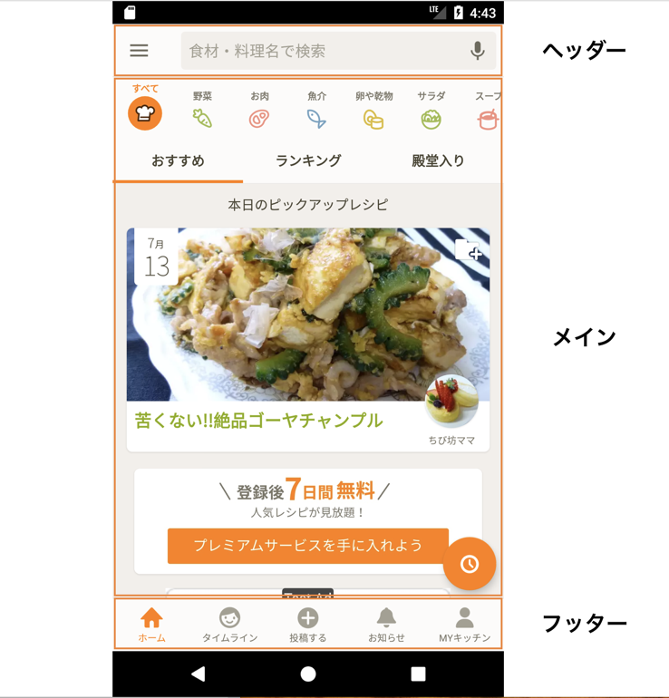

# この章の目標

- [ ] Reactのコンポーネントの作り方を理解する
- [ ] HelloWorldをフルスクラッチで書けるようになる

# クライアントアプリケーションの作り方

一般的にクライアントアプリケーションはUIコンポーネントの集合体なので、「コンポーネントの作り方」と「レイアウトの組み方」を理解すると静的なアプリケーションが作成出来ます。
講義の前半はReactNativeでのコンポーネントの作り方とレイアウトの方法を説明していきます。

# コンポーネントとは？

Cookpadアプリを例にすると、"ヘッダー"と"メイン"と"フッター"の大きく３つのコンポーネントに分類できます。
それぞれのコンポーネントは更に小さいコンポーネントに分類できます。例えば"ヘッダー"を作るなら下記のような手順になるでしょう。

- ハンバーガーアイコンのコンポーネントを作る
- 検索窓のコンポーネントを作る
- マイクアイコンのコンポーネントを作る
- 検索コンポーネントの内部右端にマイクを配置したコンポーネントを作る
- ハンバーガーアイコンと検索コンポーネントを横並びに配置する

他のコンポーネントも複雑度は違いますが手順が増えますが大枠は同じです。



# HelloWorld!

ReactNativeではReactの作法でコンポーネントを作成します。

- `React.Component` を継承したクラスを作る
- `render` メソッドに表示したい内容を書く

WebのReactと異なる点はrender内で`<div>`要素などの要素を利用するか`react-native`が用意したコンポーネントを利用するかの違いのみです。

公式ドキュメント上でReactNativeの振る舞いを試す事が出来るので、このページでHelloWorldを表示させましょう。
https://facebook.github.io/react-native/docs/tutorial.html#hello-world

```jsx
import React from 'react';
import { StyleSheet, Text, View } from 'react-native';

export default class App extends React.Component {
  render() {
    return (
      <View style={styles.container}>
        <Text style={styles.text}>Hello world!!</Text>
      </View>
    );
  }
}

const styles = StyleSheet.create({
  container: {
    flex: 1,
    alignItems: 'center',
    justifyContent: 'center',
  },
  text: {
    color: 'gray',
    fontSize: 32,
  },
});
```

# カスタムコンポーネントを描画する

`View`, `Text` などと同様に自作コンポーネントも扱うことが出来ます。`BlueTextComponent`という青い文字列の"HelloWold!"を表示するコンポーネントを作って先程のコードに追加しました。

```jsx
import React from 'react';
import { StyleSheet, Text, View } from 'react-native';

export default class App extends React.Component {
  render() {
    return (
      <View style={styles.container}>
        <Text style={styles.text}>Hello world!!</Text>
        <BlueTextComponent />
      </View>
    );
  }
}

class BlueTextComponent extends React.Component {
  render() {
    return (
      <Text style={{color:'blue'}}>Hello world!!</Text>
    );
  }
}

const styles = StyleSheet.create({
  container: {
    flex: 1,
    alignItems: 'center',
    justifyContent: 'center',
  },
  text: {
    color: 'gray',
    fontSize: 32,
  },
});

```
