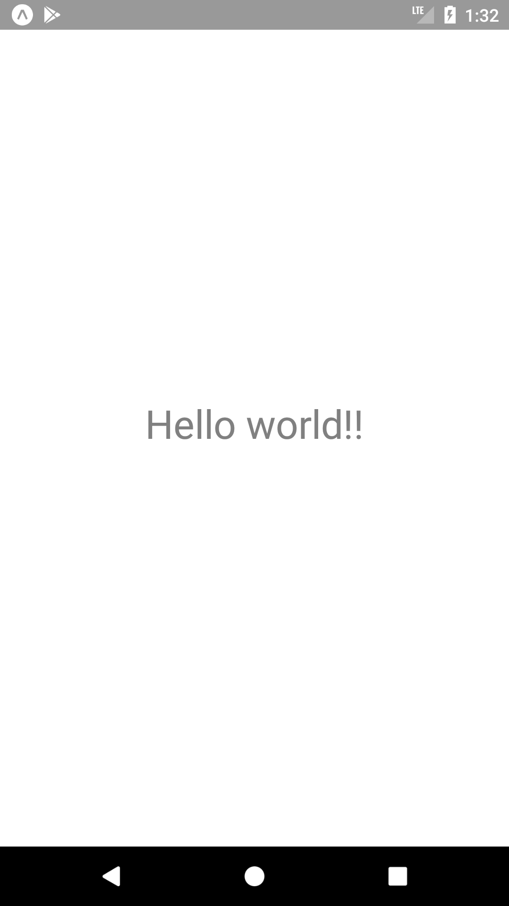
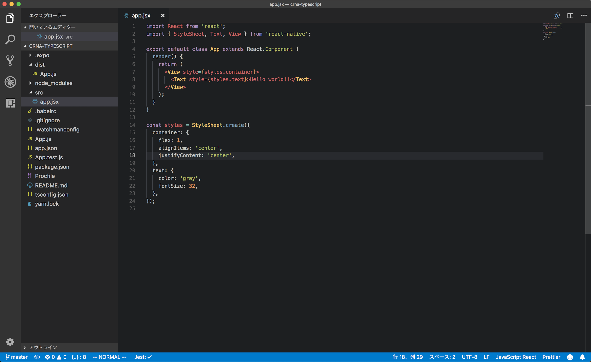

# この章の目標

- [ ] 手元の端末で"HelloWorld"を表示する
- [ ] コンポーネントをtsxで書けるようになる

# 手元でプロジェクトを作成

ローカル環境でReactNativeのプロジェクトを作成します。雛形のレポジトリを用意しているので手元にcloneしてください。
`yarn start` するとターミナル上にQRコードが表示されiOS/Androidで読み取ると手元の開発環境に繋がります。
"Hello World!"が画面に表示されたら成功です。

```sh
# ネットワークをWLAN1に戻してからclone
git clone git@github.com:cookpad/slackpad-client-base.git
cd slackpad-client-base
yarn
yarn start
```


#### yarnの実行でエラーが出た方

下記のメッセージが出た場合は指示に従って`sysctl`で設定を変更してください。

```sh
See https://git.io/v5vcn for more information, either install watchman or run the following snippet:
  sudo sysctl -w kern.maxfiles=5242880
  sudo sysctl -w kern.maxfilesperproc=524288
error Command failed with exit code 1.
```

| iOS | Android |
| :----: | :------: |
|  |  | 


# Visual Studio Codeでプロジェクトを開く

`ファイル>開く` で該当のプロジェクトを開くだけで大丈夫です。



[余談] CLI上から`code .`で起動できるようにしておくと便利
https://code.visualstudio.com/docs/setup/mac

# 保存時に自動でコードフォーマットする

[推奨]
[prettier-vscode](https://marketplace.visualstudio.com/items?itemName=esbenp.prettier-vscode) を開いてインストールする。
`⌘+Shift+P`で窓を出して "Preference: Open User Settings" を開いて下記を追加する。

```js
    // Set the default
    "editor.formatOnSave": false,
    // Enable per-language
    "[javascript]": {
        "editor.formatOnSave": true
    },
    "[javascriptreact]": {
        "editor.formatOnSave": true
    },
    "[typescript]": {
        "editor.formatOnSave": true
    },
    "[typescriptreact]": {
        "editor.formatOnSave": true
    },
```

# なぜHello World!が表示されるのか

下記のようなコードが`index.expo.js` にあり、SampleScreenをRootコンポーネントに指定しているためです。
```js
import { registerRootComponent } from 'expo';
import SampleScreen from './src/screen/SampleScreen';

registerRootComponent(SampleScreen);
```

# [課題3-1]LoginScreenをRootComponentにする(10min)

- index.expo.jsを書き換えて起動時にLoginScreenが表示されるように変更して下さい
- LoginScreenは空なのでフルスクラッチでReactコンポーネントを書いてみましょう
- 表示内容は"Hello LoginScreen"でお願いします

TypeScriptでのコンポーネントの書き方はSampleScreen.tsxなどが参考になります。
