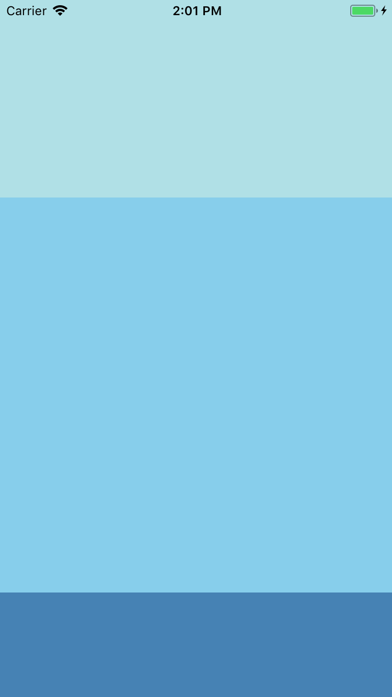
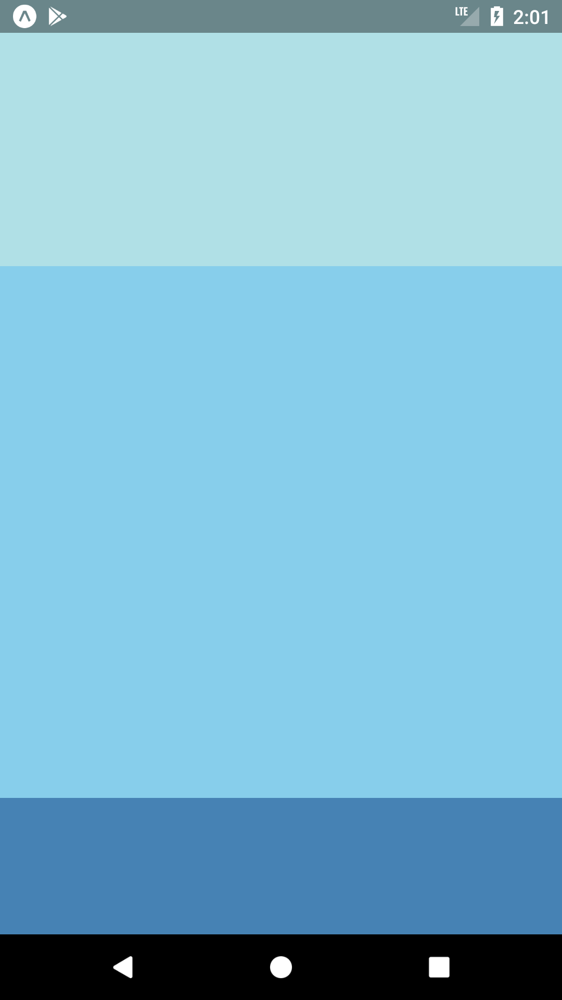
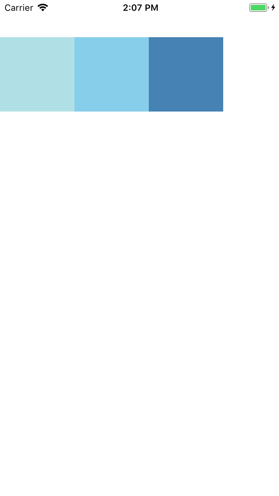
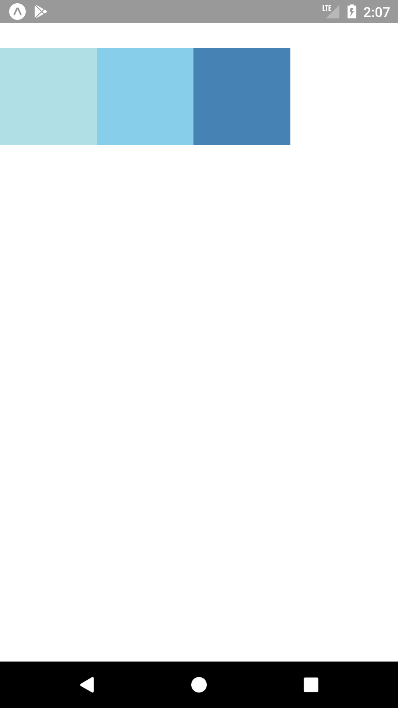
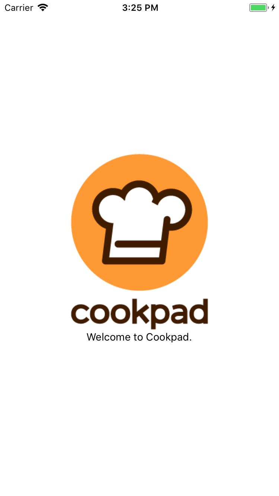
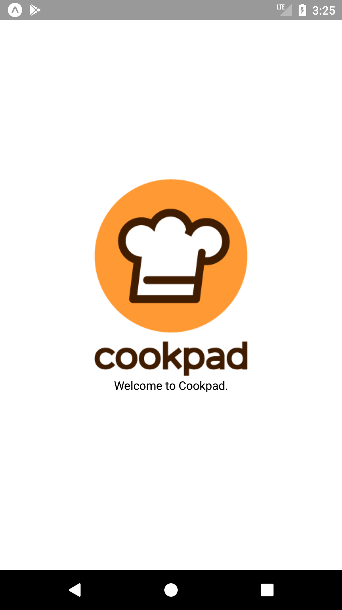
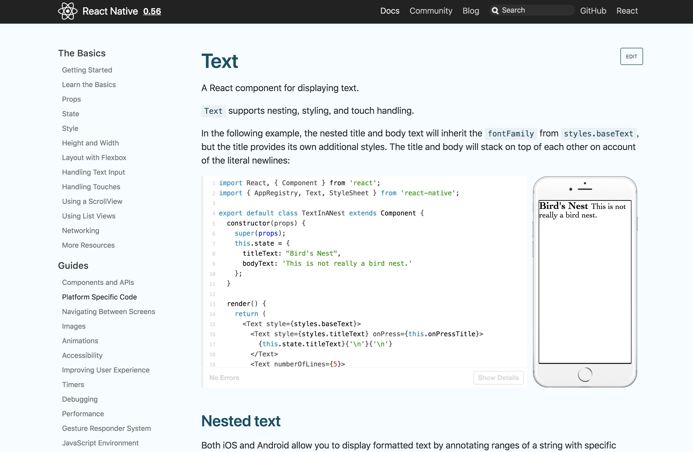
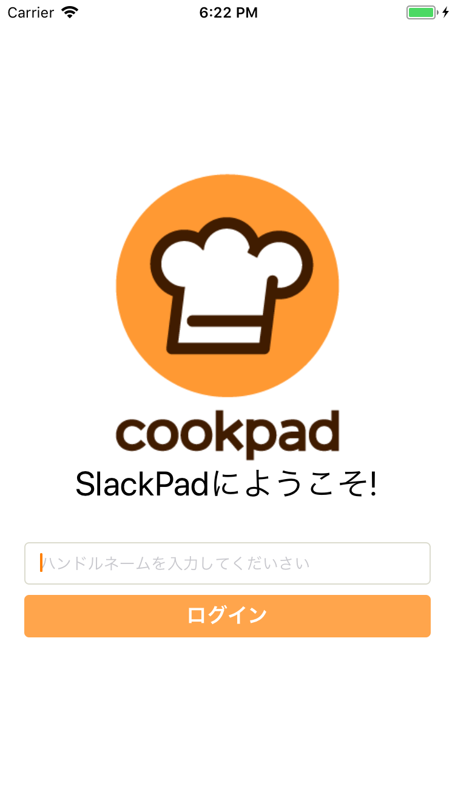
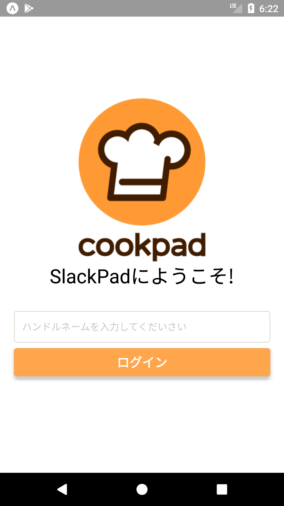

# この章の目標

- [ ] Flexboxを利用したレイアウト方法を理解する
- [ ] よく使うコンポーネントの使い方を理解する
- [ ] 課題のログイン画面が実装出来るようになる

# Flexboxとは

- 簡単かつ柔軟に要素のレイアウトが出来るモジュール
 - Webブラウザの世界(CSS)で使われていたものが様々な環境に移植されている
- ReactNativeでも利用することが可能

https://developer.mozilla.org/ja/docs/Web/CSS/CSS_Flexible_Box_Layout/Basic_Concepts_of_Flexbox

# Flexboxの機能

今日の講義で扱うFlexboxの主要な三つの機能

- 自身の要素の大きさの確保(`flex`)
- 子要素を縦 or 横どちら向きに並べるか(`flexDirection`)
- 子要素を先頭揃え,中央揃え,均等揃え,終端揃えなどどのように配置するか (`justifyContent`など)

# 基本の組み方

## 複数コンポーネントの幅の分配


```jsx
<View style={{flex: 1}}>
  <View style={{flex: 1, backgroundColor: 'powderblue'}} />
  <View style={{flex: 2, backgroundColor: 'skyblue'}} />
  <View style={{height: 100, backgroundColor: 'steelblue'}} /> //  height:100が確保された後に残りを1:2に分配する 
</View>
```

| iOS | Android |
| :----: | :------: |
|  |  | 
## 横並び

```jsx
<View style={{flex: 1, flexDirection: 'row', marginTop: 50}}> // flexDirection: 'column'にすると縦並び(デフォルト)
  <View style={{width: 100, height: 100, backgroundColor: 'powderblue'}} />
  <View style={{width: 100, height: 100, backgroundColor: 'skyblue'}} />
  <View style={{width: 100, height: 100, backgroundColor: 'steelblue'}} />
</View>
```

| iOS | Android |
| :----: | :------: |
|  |  | 

## 水平/垂直方向に中央そろえ


```tsx
<View style={{ flex: 1, alignItems: 'center', justifyContent: 'center' }}>
  <Image style={{ width: 240, height: 240 }} source={require('../../assets/cookpad.png')} />
  <Text>Welcome to Cookpad.</Text>
</View>

```

| iOS | Android |
| :----: | :------: |
|  |  | 

## Flexbox系プロパティのおさらい

### flex:number

要素の表示する割合を指定する。

### flexDirextion:(column,row,column-reverse,row-reverse)

子要素のコンポーネントを並べる向き先を指定する。

### justfyContent: (center,flex-end,flex-start,space-around,space-between,space-evenry)

主軸における子要素の配置を指定する。

### alignItems: (baseline,center,flex-end,flex-start,stretch)

交差軸における子要素の配置を指定する。

# よく使うコンポーネント

今回の講義で利用する可能性のあるコンポーネントのみ簡単に紹介します。

## Text

```tsx
<Text>HelloWorld!</Text>
```

## TextInput

```tsx
<TextInput
  placeholder="名前を入力して下さい"
  value="Cookpad太郎"
  onChangeText={text => (this.userName = text)} //入力内容を`userName`プロパティに代入
/>
```

## Image

### リモートの画像を読み込む場合

```tsx
<Image
  style={styles.user_icon} // widthを指定しないと画像が表示されないので注意
  source={{uri: 'https://example.com/image.png'}}
/>

```

### ローカルの画像を読み込む場合

```tsx
<Image style={styles.image} source={require('../../assets/cookpad.png')} />
```

## Button

```tsx
<Button title="ログイン" onPress={() => {
  Alert.alert("ログインボタンが押されました!");
}} />
```

## TouchableOpacity

```tsx
<TouchableOpacity
  onPress={() => {
    Alert.alert("テキスト要素が押されました!");
  }}
>
  <Text> Touch Here </Text> // ここ(子要素)にタッチイベントを実装することが出来る
</TouchableOpacity>
```

# その他のコンポーネントやスタイル

## その他のコンポーネントについて

今回の実装に必要なコンポーネントについては都度紹介します。その他にどういうものがあるか知りたい場合は[Components and APIs](https://facebook.github.io/react-native/docs/components-and-apis.html)で確認できます。

## スタイルについて

エディタの補完で8割解決すると思います。困った時は各コンポーネントのドキュメントをみましょう。 i.e. [Text#style](https://facebook.github.io/react-native/docs/text#style)





# [課題4-1]ログイン画面を作る(30min)

これまでの知識やReactNativeのドキュメントを読んで下記のようなログイン画面を作ってみましょう。

- スタイルは大まかで大丈夫です
- ログインボタンを押したら適当なメッセージのAlertを表示させましょう


<br/>
<details>
<summary><font size=1 color='#ccc'>[ヒント]スタイリングで詰まった時 :eyes: </font></summary>
```js
const styles = StyleSheet.create<Styles>({
  textInput: {
    marginTop: margin.size_32,
    borderWidth: 1,
    borderColor: Color.border,
    borderRadius: 4,
    width: '100%',
    paddingHorizontal: padding.size_12,
    paddingVertical: padding.size)8,
    color: color.darkGray,
    backgroundColor: color.white,
  },
  buttonWrapper: {
    marginTop: margin.size_8,
    elevation: 4,
    width: '100%',
    borderRadius: 4,
    backgroundColor: color.lightOrange,
  },
  buttonText: {
    paddingVertical: padding.size_8,
    width: '100%',
    color: color.white,
    textAlign: 'center',
    fontSize: fontSize.extraLarge,
    fontWeight: 'bold',
  },
});
```
</details>
<br/>

| iOS | Android |
| :----: | :------: |
|  |  | 


# キーボードで入力欄が隠れてしまう場合の対応

[KeyboardAvoidingView](https://facebook.github.io/react-native/docs/keyboardavoidingview)を利用しましょう。
KeyboardAvoidingViewで全体を囲うような階層構造にするとキーボードが出現した時にViewのpaddingや高さを微調整してくれます。

```tsx
render(){
 <View style={styles.container}>
     <KeyboardAvoidingView keyboardVerticalOffset={75} behavior="padding">
     {...children}
     </KeyboardAvoidingView>
 </View>
}
