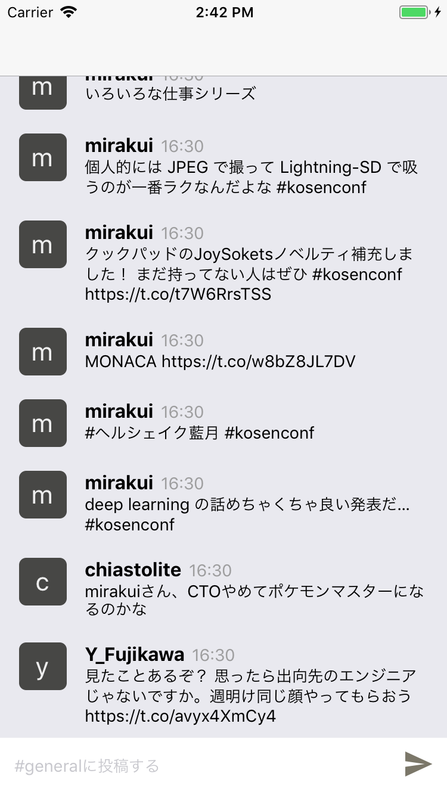
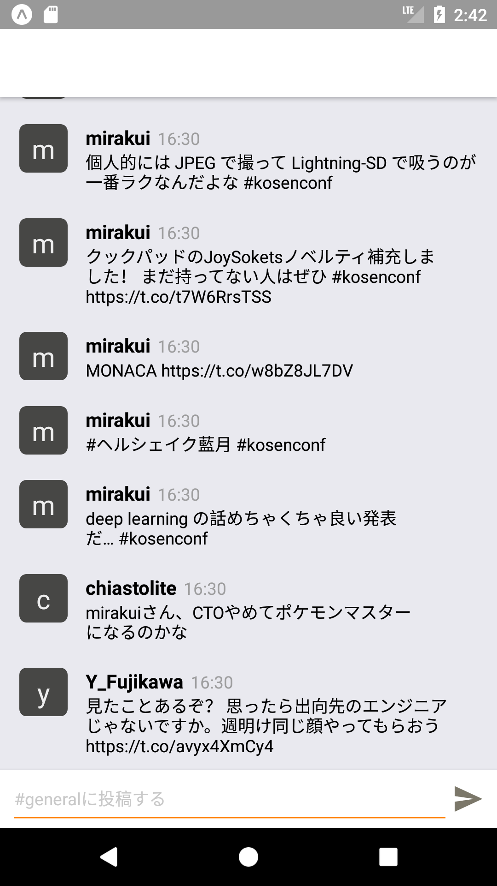

# この章の目標

- [ ] Fetch APIを使ってHttpリクエストが扱えるようになる
- [ ] FlatListを使ってリスト表示が出来るようになる
- [ ] APIレスポンスをFlatListでリストを表示する実装が出来るようになる
- [ ] websocketを使った双方向通信が出来るようになる

# Fetch API

## Fetch APIとは

- 現代のXMLHttpRequestのようなもの
- WHATWGによって標準化され、ほとんどのモダンブラウザで利用可能
- ReactNativeでも同様のインターフェースで使える

https://developer.mozilla.org/ja/docs/Web/API/Fetch_API/Using_Fetch


### GET

```typescript
const response = await fetch('https://example.com/images/1');
```

### POST

```typescript
const request = {
  method: 'POST',
  headers: {
    Accept: 'application/json',
    'content-type': 'application/json',
  },
  body: JSON.stringify({image: base64String}),
};
const response = await fetch('https://example.com/images', request)
```

### Responseを扱う

エラー時(4xx,5xx)も例外を吐かないので正常なやり取りが出来たか始めに確認する必要があります。

```typescript
if(response.ok) { //200系が返ってきていることを確認
  return await response.json(); //レスポンス内容は非同期で受け取る
}
```
https://developer.mozilla.org/ja/docs/Web/API/Response

## 簡易APIClient

FetchAPIはそのまま使うと

- 返り値がany
- クエリパラメータのエンコード機能がない

などの不便があるので今回は薄くラップした[APIClient](https://github.com/cookpad/slackpad-client-base/blob/master/src/repository/ApiClient.ts)を経由して利用します。

### 型を指定してGET

```typescript
intreface Image {
  id: number;
  url: string;
  width: number;
  height: number;
}
const image = await = ApiClient.get<Image>(`images/${imageId}`);
return image.url;
```

# FlatList

## FlatListとは

- ReactNative公式のリストを表示するのコンポーネント
- 多機能でかつインターフェースが扱いやすい

https://facebook.github.io/react-native/docs/flatlist

## 最小実装

```javascript
<FlatList
  data={[{key: 'a'}, {key: 'b'}]} //データセットの提供
  renderItem={({item}) => <Text>{item.key}</Text>} //描画方法の指定
/>
```

## APIからデータを受け取り表示

架空のAPIから過去のメッセージの一覧を取得する実装例です。ポイントは3点あります。

- `componentDidMount` でAPIリクエストする
- 結果をStateに保存する
- FlatListのデータソースはStateを参照する

```typescript
interface Props {}
interface State {
  messages: Message[];
}

interface Message {
  id: number;
  text: string;
}

class App extends React.Component<Props, State> {
  //コンポーネントが描画されるタイミングで呼ばれるイベント
  async componentDidMount() { 
    const messages = await ApiClient.get<Message[]>('channels/1/messages');
    this.setState({ messages }); // コンポーネントの状態を差分更新
  }
  render() {
    return (
      <FlatList
        keyExtractor={item => { return String(item.id);}}
        data={this.state.messages}
        renderItem={({ item }: { item: Message }) => <Text>{item.text}</Text>}
      />
    );
  }
}
```

# FlatListの便利機能

ネイティブ実装だとかなり苦労するPull-to-Refreshや無限スクロールも数行で実装できます。今回は省略しますがヘッダー,フッター,複数カラムや横向きのスクロールなどで手軽に作成できます。

# Pull-to-Refresh

```diff
      <FlatList
        keyExtractor={item => { return String(item.id);}}
        data={this.state.messages}
        renderItem={({ item }: { item: Message }) => <Text>{item.text}</Text>}
+       onRefresh={() => { handleOnRefresh(); }} //再読込処理を呼び出す
+       refreshing={this.state.refreshing} //リフレッシュ処理が走っているか状態をセット
      />
```

# 無限スクロール

```diff
      <FlatList
        keyExtractor={item => { return String(item.id);}}
        data={this.state.messages}
        renderItem={({ item }: { item: Message }) => <Text>{item.message}</Text>}
+       onEndReached ={() => { handleonEndReached(); }} //次ページのデータを読み込む
      />
```

# [課題7-1]: チャットUIの作成(30min)

- 上部にチャットログが並び、下部にメッセージ入力欄と送信ボタンがあるUIを作成する
- チャットログの内容はAPIから取得してください
- 最新の投稿が一番下に来るようにしてください

### スクリーンショット

| iOS | Android |
| :---: | :----: |
|  |  |

# [課題7-2]: メッセージの投稿(30min)

API仕様はサーバーサイドの講義資料を参照して下さい

- `POST /channels/:channel_id/messages` にAPIリクエストしてメッセージを投稿出来るようにしましょう
- メッセージの投稿に成功したらTextInputを空にして、キーボードを隠してください

# [課題7-3] 過去ログの更新(20min)

- Pull-to-Refreshでメッセージのログが更新出来るようにして下さい
